# DinnerChamp
Course project for WIUT

Backend url: [here](https://api.dinnerchamp.tech).

Business website url: [here](https://business.dinnerchamp.tech).

Ordering website url: [here](https://dinnerchamp.tech).

<!-- link local image -->
## Business Website

- Restaurant login / registration
- Restaurant profile management
- Restaurant menu management (CRUD)
- Employee management (CRUD)
- Branch management (CRUD)
- Category management (CRUD)
- Statistics

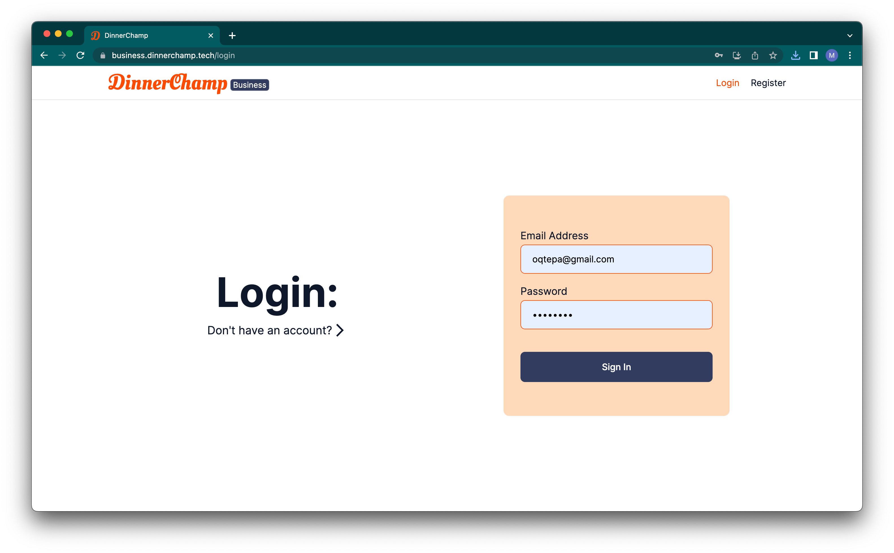

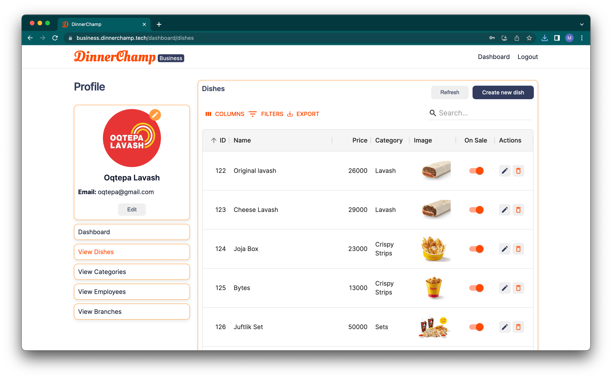

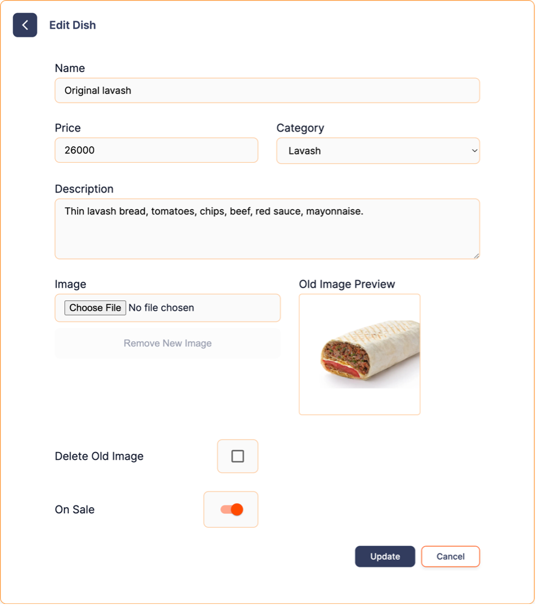

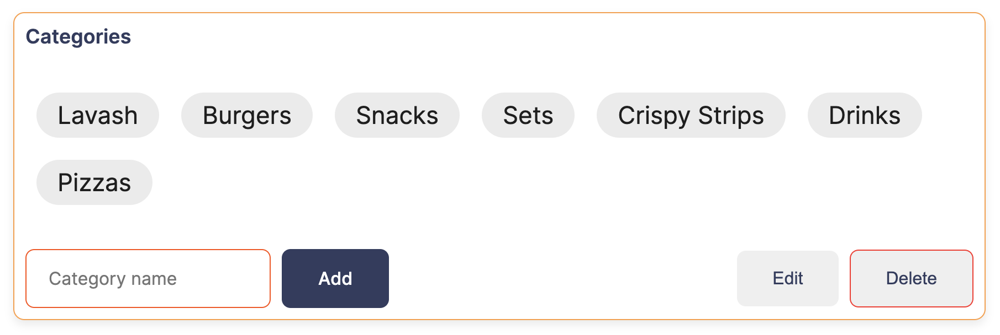

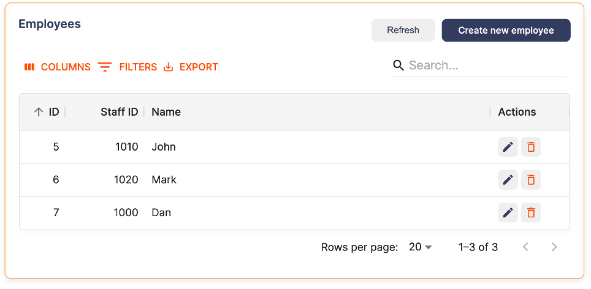

## Ordering Website

- User authentication
- Restaurant search
- Restaurant menu and profile view
- Restaurant menu filtering
- Branch selection
- Cart management
- Order placement
- Order history and status tracking

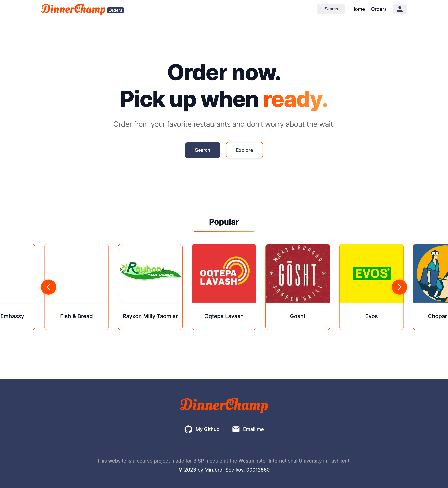

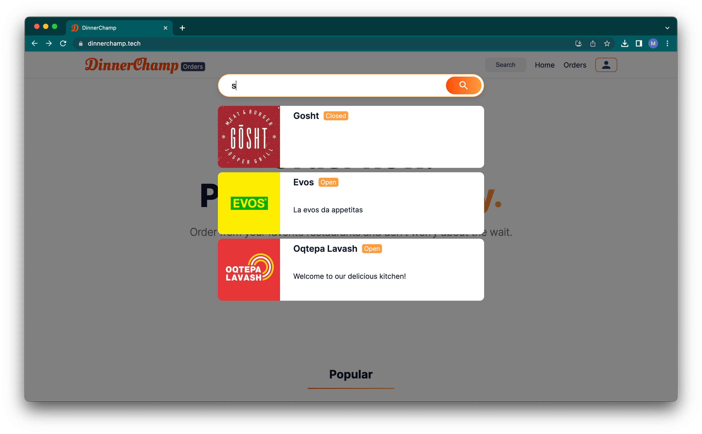

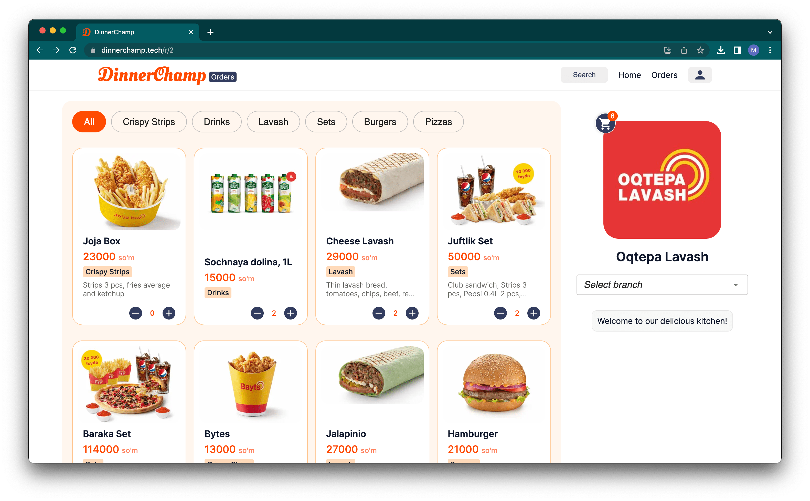

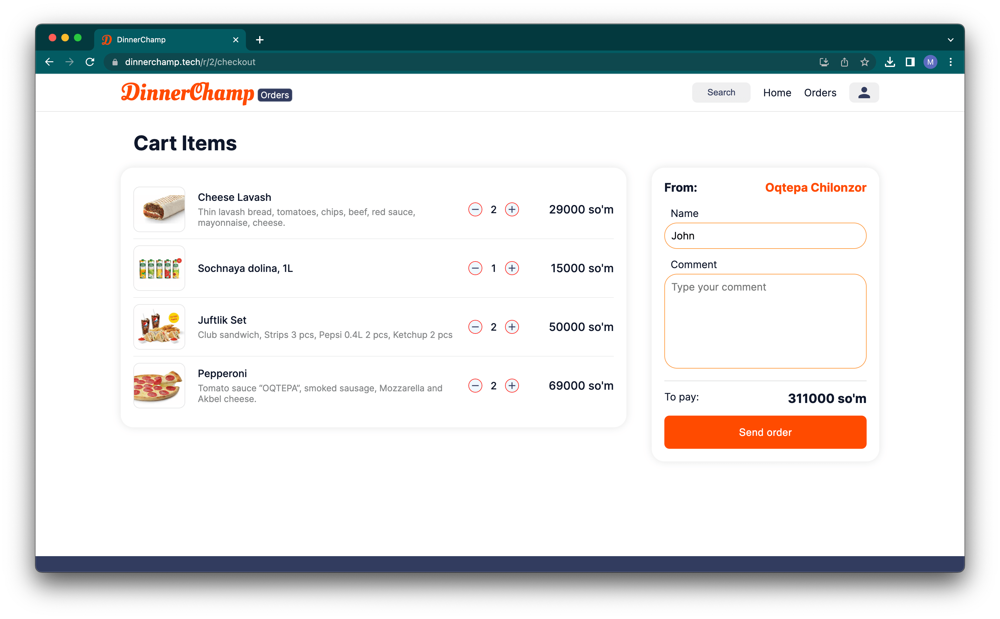

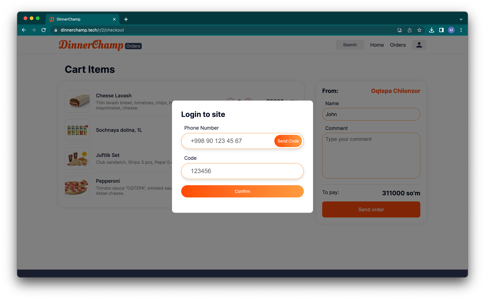

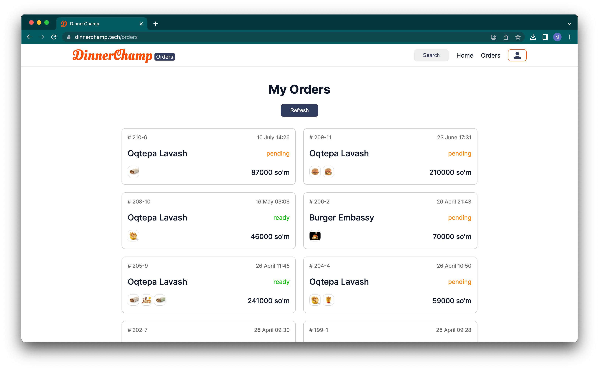

## Tablet App

- Restaurant login
- Branch login
- Employee login
- Real-time tickets view
- Order status management
- Branch open/close management

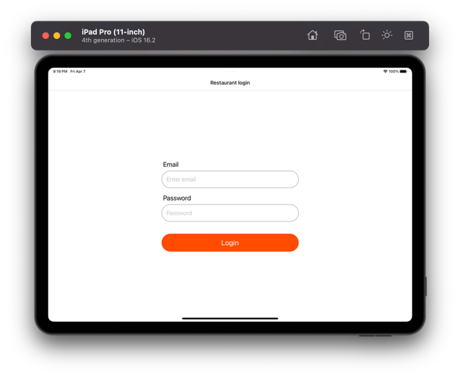

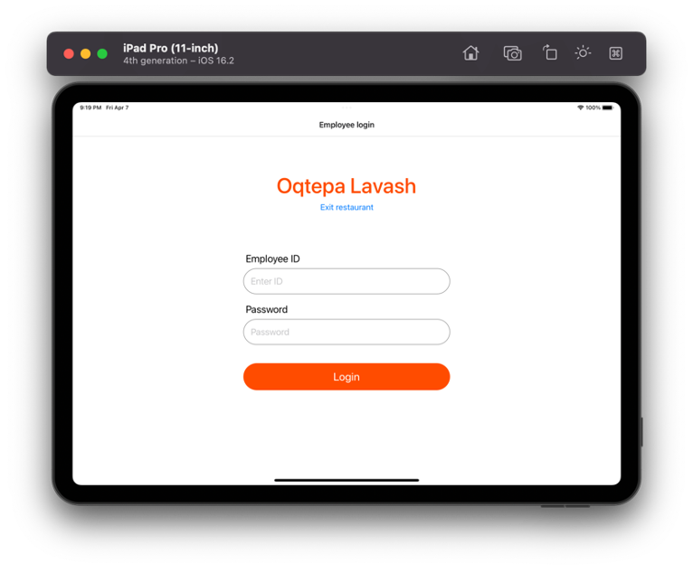

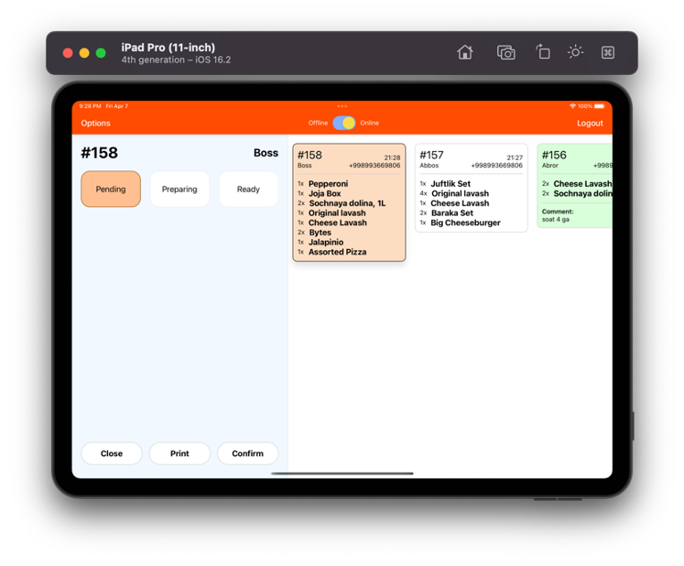